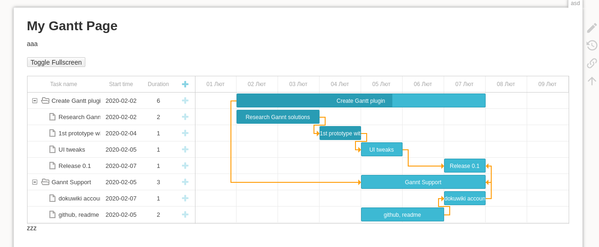
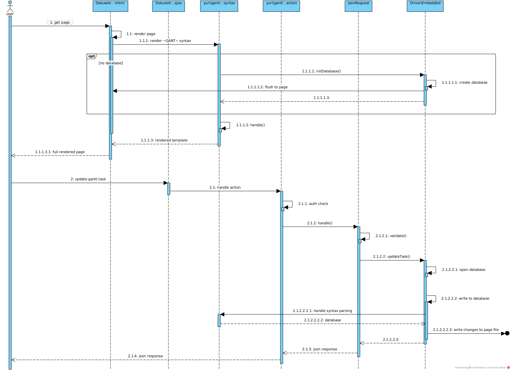

# Yurii's Gantt Plugin

This plugin allow you to add Gantt table into Dokuwiki page.




In nutshell, it just wraps [dhtmlxGantt Standard](https://dhtmlx.com/docs/products/dhtmlxGantt).
If your project is commercial, you have to purchase dhtmlxGantt PRO license and replace its installation code at *lib/plugins/yuriigantt/3rd/dhtmlxgantt*.

## Installation

1. automatic TODO
1. manual
    ```
    cd YOUR_DOKUWIKI_DIR/lib/plugins
    git clone --single-branch --branch master https://github.com/yurii-github/dokuwiki-plugin-yuriigantt.git yuriigantt
    ```

## Usage

1. create/request new dokuwiki page from your browser
1. add the least required syntax into the page
    ```
    ~~NOCACHE~~
    ~~~~GANTT~~~~

    ~~~~~~~~~~~
    ```
1. save. you must see now 
1. (Optional) Click page edit. You will see that data for empty embedded database was initialized
    ```
    ~~NOCACHE~~
    ~~~~GANTT~~~~
    {
        "pageId": "asd",
        "version": "1.0",
        "dsn": ":embedded:",
        "increment": {
            "task": 1,
            "link": 1
        },
        "gantt": {
            "data": [],
            "links": []
        }
    }
    ~~~~~~~~~~~
    ```
You can also try this demo example instead
```
====== My Gantt Page ======

aaa

~~NOCACHE~~
~~~~GANTT~~~~
{
    "pageId": "asd",
    "version": "1.0",
    "dsn": ":embedded:",
    "increment": {
        "task": 12,
        "link": 8
    },
    "gantt": {
        "data": [
            {
                "id": 2,
                "text": "Create Gantt plugin",
                "start_date": "02-02-2020 00:00",
                "duration": 6,
                "progress": 0.6254681647940075,
                "parent": 0,
                "open": true,
                "order": 0,
                "target": ""
            },
            {
                "id": 3,
                "text": "Research Gannt solutions",
                "start_date": "02-02-2020 00:00",
                "duration": 2,
                "progress": 1,
                "parent": 2,
                "open": true,
                "order": 0,
                "target": ""
            },
            {
                "id": 4,
                "text": "1st prototype \nwith embedded database",
                "start_date": "04-02-2020 00:00",
                "duration": 1,
                "progress": 1,
                "parent": 2,
                "open": true,
                "order": 0,
                "target": ""
            },
            {
                "id": 5,
                "text": "UI tweaks",
                "start_date": "05-02-2020 00:00",
                "duration": 1,
                "progress": 0,
                "parent": 2,
                "open": true,
                "order": 0,
                "target": ""
            },
            {
                "id": 6,
                "text": "Release 0.1",
                "start_date": "07-02-2020 00:00",
                "duration": 1,
                "progress": 0,
                "parent": 2,
                "open": true,
                "order": 0,
                "target": ""
            },
            {
                "id": 7,
                "text": "Gannt Support",
                "start_date": "05-02-2020 00:00",
                "duration": 3,
                "progress": 0,
                "parent": 0,
                "open": true,
                "order": 0,
                "target": "next:10"
            },
            {
                "id": 8,
                "text": "create plugin repository, docs",
                "start_date": "02-02-2020 00:00",
                "duration": 1,
                "progress": 0,
                "parent": 1580811589330,
                "open": true,
                "order": 0,
                "target": null
            },
            {
                "id": 9,
                "text": "dokuwiki account",
                "start_date": "05-02-2020 00:00",
                "duration": 1,
                "progress": 0,
                "parent": 1580811589330,
                "open": true,
                "order": 0,
                "target": null
            },
            {
                "id": 10,
                "text": "dokuwiki account",
                "start_date": "07-02-2020 00:00",
                "duration": 1,
                "progress": 0,
                "parent": 7,
                "open": true,
                "order": 0,
                "target": "11"
            },
            {
                "id": 11,
                "text": "github, readme",
                "start_date": "05-02-2020 00:00",
                "duration": 2,
                "progress": 0,
                "parent": 7,
                "open": true,
                "order": 0,
                "target": "10"
            }
        ],
        "links": [
            {
                "id": 1,
                "source": 3,
                "target": 4,
                "type": "0"
            },
            {
                "id": 2,
                "source": 4,
                "target": 5,
                "type": "0"
            },
            {
                "id": 3,
                "source": 5,
                "target": 6,
                "type": "0"
            },
            {
                "id": 4,
                "source": 2,
                "target": 7,
                "type": "1"
            },
            {
                "id": 5,
                "source": 11,
                "target": 10,
                "type": "0"
            },
            {
                "id": 6,
                "source": 10,
                "target": 7,
                "type": "2"
            },
            {
                "id": 7,
                "source": 7,
                "target": 6,
                "type": "2"
            }
        ]
    }
}
~~~~~~~~~~~


zzz
```


## How It Works

NOTE! Currently only embedded database driver is supported



### Drivers
#### Embedded
Info about gantt database is stored in page within special pattern in JSON format.
Embedded database also stores its data near database info.
```
~~~~GANTT~~~~
{
    "pageId": "asd", <--- page identifier
    "version": "1.0", <-- RESERVED version idetificator
    "dsn": ":embedded:", <-- says parser what database driver was used
    "increment": { <--- EMBEDDED table increments
        "task": 12,
        "link": 8
    },
    "gantt": { <----- EMBEDDED table data
~~~~~~~~~~~
```
On each user update dokuwiki file is parsed, database extracted, its data get changes and with new changes database is stored back to dokuwiki file.


**NOTE! If you have file with size more than 10k bytes, please consider to use other drivers!**

## For Developer

If you change syntax parser, to refresh rendered page cache please run page with purge
```
http://127.0.0.1:8000/doku.php?id={PAGEID}&purge=true
```

#### DXHTML

* https://docs.dhtmlx.com/gantt/desktop__howtostart_php.html
* https://dhtmlx.com/blog/integrating-gantt-php-using-rest-api-slim-mysql/
* https://docs.dhtmlx.com/gantt/desktop__howtostart_php.html
